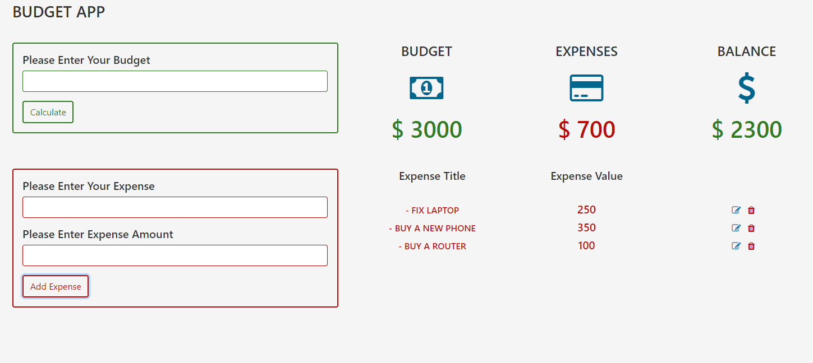

# A Simple Budget App

This is a simple practice project on creating a budget app, where a user can record his expenses and incomes on things 
that a user has used. A user can enter items that have increased his income and also items that have been used as
expenses.

Additional description about the project and its features.

## Built With

- HTML
- CSS
- Javascript
- Webpack
- Bootstrap 4

## Live Version

[Live Link](https://emmanuelkamala.github.io/budgetApp/)

## Getting Started

Open your terminal or text editor and use next command

  git clone https://github.com/emmanuelkamala/budgetApp.git

  cd budgetApp

  Run: 'npm install', to install all the dependencies

  Run: 'npm run dev', to compile the files, and start localserver

  visit: localhost:8080 on the browser

After if you want to do any changes please create new branch, after changes open pull request.
Happy coding! 

## Authors

👤 **Author**

- Github: [@githubhandle](https://github.com/emmanuelkamala)
- Twitter: [@twitterhandle](https://twitter.com/ejkamala)
- Linkedin: [linkedin](https://linkedin.com/emmanuelkamala)

